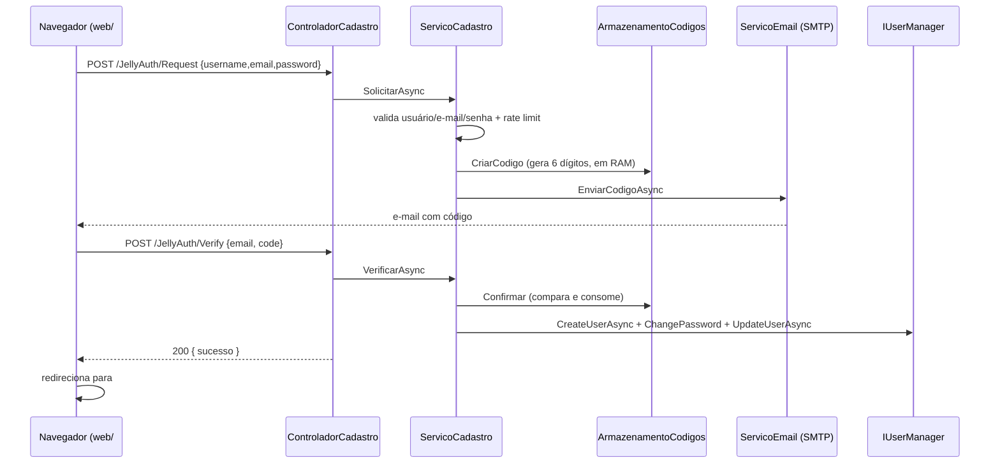

---
tags:
  - arquitetura
  - jellyauth
  - jellyfin
  - plugin
created: 2026-09-23
---

# Arquitetura do Plugin

> Visão geral dos componentes C# e do fluxo de auto-cadastro do **JellyAuth**.

## Diagrama de componentes

```text
┌─────────────────────────────────────────────────────────────────────────┐
│ Jellyfin Server (DI container)                                          │
│                                                                         │
│  Plugin.cs  (BasePlugin<ConfiguracaoPlugin> + IHasWebPages)             │
│  RegistroServicos.cs  (IPluginServiceRegistrator)                       │
│                                                                         │
│  ┌─────────────── API ────────────────┐   ┌────────── Serviços ───────┐ │
│  │ ControladorCadastro (público)      │──▶│ ServicoCadastro (regras)  │ │
│  │   /JellyAuth/Status             │   │ ServicoEmail (SMTP)       │ │
│  │   /JellyAuth/client.js          │   │ InjetorScriptWeb (middle) │ │
│  │   /JellyAuth/Request|Verify     │   └───────────────────────────┘ │
│  │   /JellyAuth/Resend             │              │                  │
│  │ ControladorAdmin (RequiresElevation)│             │                  │
│  │   /JellyAuth/Admin/TestarEmail  │   ┌────────── Dados ──────────┐ │
│  └────────────────────────────────────┘   │ ArmazenamentoCodigos (RAM)│ │
│                                           │ ArmazenamentoCadastros    │ │
│  Seguranca/InicioCadastro (IStartupFilter)│   (JSON em plugins/config)│ │
│  └──▶ UseMiddleware<InjetorScriptWeb>     └───────────────────────────┘ │
│                                                                         │
│  APIs nativas usadas: IUserManager, (ILibraryManager via painel)        │
└─────────────────────────────────────────────────────────────────────────┘
```

## Camadas

### 1. `Plugin.cs`
- Herda `BasePlugin<ConfiguracaoPlugin>` — persistência automática da configuração (XML em `plugins/configurations/Jellyfin.Plugin.JellyAuth.xml`).
- Implementa `IHasWebPages` para registrar o **painel admin** (`Configuracao/painel.html` como recurso embutido).
- `Instancia` estática: permite que os serviços leiam a configuração atual via `Func<ConfiguracaoPlugin>`.

### 2. `RegistroServicos.cs`
- Implementa `IPluginServiceRegistrator`, registrando:
  - `Func<ConfiguracaoPlugin>` → leitura sempre atual da config (sem reiniciar).
  - `TimeProvider.System` (clock injetável, testável).
  - `ArmazenamentoCodigos`, `ArmazenamentoCadastros`, `ServicoEmail`, `ServicoCadastro`.
  - `IStartupFilter` → `InicioCadastro` (middleware de injeção do script).

### 3. API
| Controller | Rota | Auth |
|---|---|---|
| `ControladorCadastro` | `/JellyAuth/*` | `[AllowAnonymous]` |
| `ControladorAdmin` | `/JellyAuth/Admin/*` | `RequiresElevation` (admin) |

Detalhes em [[API-Request]], [[API-Verify]], [[API-Resend]].

### 4. Serviços
- **`ServicoCadastro`** — validações (usuário/e-mail/senha), rate limit, criação do usuário, aplicação de permissões (download; bibliotecas ficam desligadas, gerenciadas pelo JellyPix).
- **`ServicoEmail`** — envia o código via `System.Net.Mail.SmtpClient` (sem dependência externa). Usado só quando `ExigirVerificacaoEmail` está ligado.
- **`InjetorScriptWeb`** — injeta `<script>` no `index.html` em tempo de execução (ver [[ADR-001 - Injeção de JS no Jellyfin Web]]).

### 5. Dados
- **`ArmazenamentoCodigos`** — códigos e rate limit em memória (`ConcurrentDictionary`) (ver [[ADR-002 - Armazenamento de Códigos Temporários de Verificação]]).
- **`ArmazenamentoCadastros`** — JSON (`plugins/configurations/JellyAuth.cadastros.json`) com o mapeamento e-mail→usuário (o `User` nativo não tem campo de e-mail).
- **`ArmazenamentoSegredos`** — senha SMTP em arquivo próprio (`JellyAuth.smtp-senha.txt`, modo 0600), fora da configuração XML (não vaza pela API de config).

### 6. Rotina em background
- **`RotinaLimpeza`** (`BackgroundService`) — poda a cada 5 min códigos e contadores de rate limit expirados, além do teto de tamanho (50k), mitigando DoS de memória.

## Fluxo de ponta a ponta



## Compatibilidade entre versões (10.11 ↔ 12)

O `IUserManager` mudou de assinatura entre as séries. O plugin compila **uma DLL por série** e usa compilação condicional onde a API divergiu:

| API | Jellyfin 10.11 (net9.0) | Jellyfin 12 (net10.0) |
|---|---|---|
| `ChangePassword` | `(User, string)` | `(Guid, string)` |
| `Users` | propriedade `IEnumerable<User>` | método `GetUsers()` |
| `CreateUserAsync(string)` | idêntico | idêntico |
| `UpdateUserAsync(User)` | idêntico | idêntico |

O único ponto que o plugin toca e que divergiu é o `ChangePassword`, resolvido com `#if NET10_0_OR_GREATER` em `ServicoCadastro`. As extensões `SetPermission`/`SetPreference` (`Jellyfin.Data`) e os enums `PermissionKind`/`PreferenceKind` existem nas duas séries.

> Referência cruzada: o plugin **JellyPix** (mesmo repositório de origem) já documentou essa volatilidade da API e a resolveu com reflexão; aqui, por compilarmos DLLs separadas por série, usamos `#if`.
